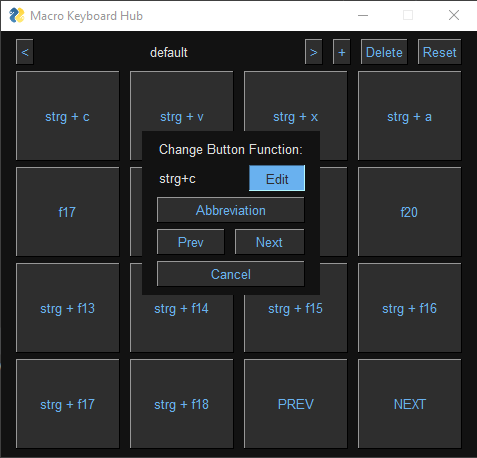

# Macro Keyboard Hub

This is the Windows software part of my MacroKeyboard Project. If you are interested in the other parts, check out the 
[Arduino software](https://github.com/Spanching/MacroKeyboard) or [Thingiverse](https://www.thingiverse.com/thing:5987051)
for the 3D printable files for the case.

# Usage

This software allows me to dynamically set the keys of my macro Keyboard to (almost) any macro I want to have. It 
consists of two parts: The graphical user interface and the listener that maps the actual key presses of the keyboard 
to their respective macros.

It also contains a (semi-) functional automatic change of configuration based on the actual foreground window. To enable
that, you have to edit the .env file and set ```USE_FOREGROUND_WINDOW_DETECTION = True``` and add all the executables 
that you want to listen to and have a configuration named after (without the file ending) to the list like this: 
```EXE_LIST = ["chrome.exe", "explorer.exe"]```

# GUI

The simple GUI I programmed uses [PySimpleGui](https://www.pysimplegui.org/en/latest/). It allows to see the current 
function of each key and when pressing the respective button, one can set new functions for the key:

|          The basic GUI           |         Edit modal for a key          |
|:--------------------------------:|:-------------------------------------:|
|  |  |

When you want to record a new macro for a key, you can simply click on the Edit button, but you can also add an 
abbreviation. This will ask you for the abbreviations name and the text that it should contain as you can see here:

|           Recording Macro            |            Abbreviation Name             |          Abbreviation Text           |
|:------------------------------------:|:----------------------------------------:|:------------------------------------:|
|  |  |  |

Now whenever you click the respective button on the Macro Keyboard, the macro will be executed, or the abbreviation 
will be written in the textfield that you are currently in. This is very nice for email addresses that you might need 
to write pretty often. Do *not* use this for passwords, as the configuration file is not encrypted yet!

# Listener

The listener for the keyboard uses the [keyboard python package](https://pypi.org/project/keyboard/) to listen for keys 
F13 to F20 and CTRL+F13 to CTRL+F20, which is what I used for my MacroKeyboard. It reads the configuration file that 
was generated and can be edited via the GUI to set the hotkeys for every key on the MacroKeyboard.
It also uses the [watchdog python package](https://pypi.org/project/watchdog/) to observe changes to the configuration
file, done by the GUI. This allows to set new functions while the listener runs.

# Installation

For easy installation of the dependencies, I use [poetry](https://python-poetry.org/), therefore you can install 
everything you need in a new virtual environment with a simple

```bash
poetry install
```

for easy usage on Windows I use [pyinstaller](https://pyinstaller.org/en/stable/). I can create two executables, one for
the gui and one for the listener like this:

```bash
pyinstaller --onefile gui.py -w
pyinstaller --onefile listener.py -w
```

I then use these executables to start the listener on Windows startup, and I have the executable for the gui handy for 
editing whenever I need to. 